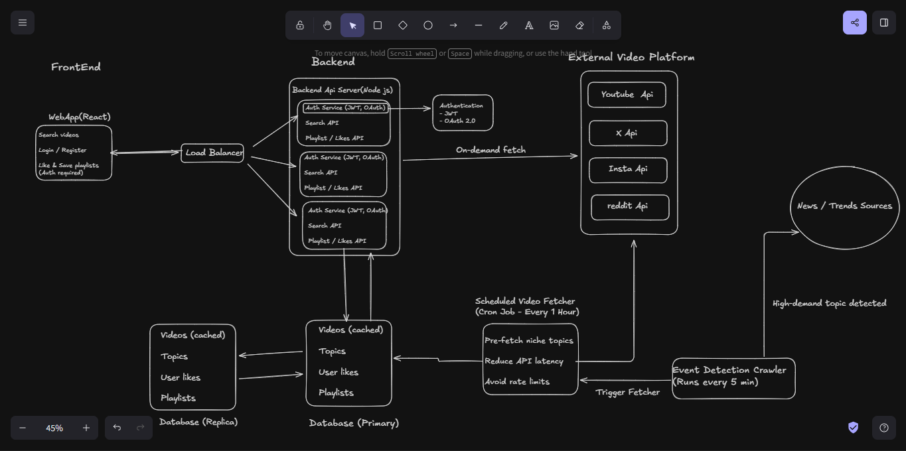
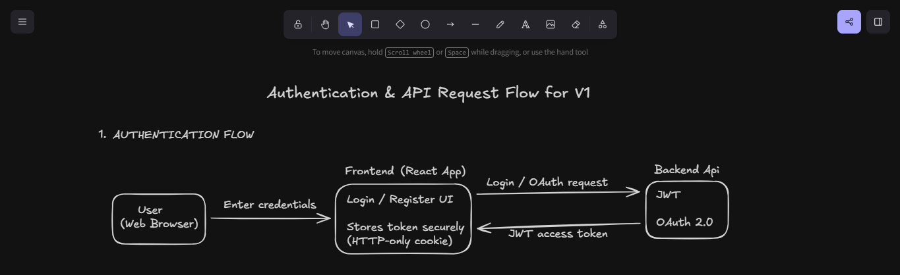
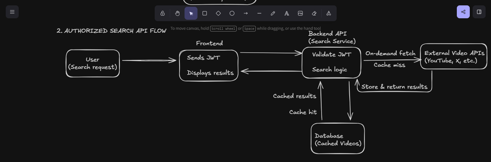
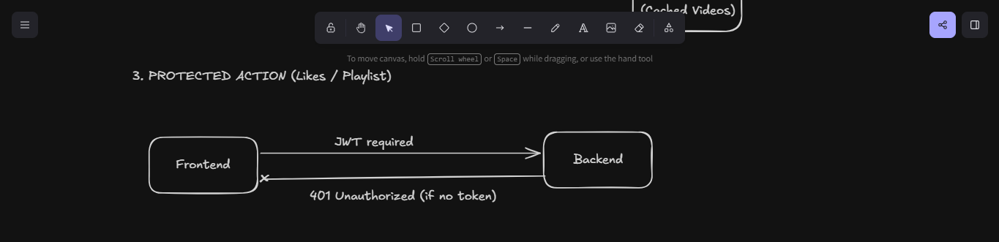

# 🎥 Video Treasure (V1)

A backend-focused video aggregation platform that allows users to search for videos from multiple platforms (YouTube, X, Instagram) through a single interface.

This project is designed as a **production-style system**, emphasizing authentication, API orchestration, caching, and scalability rather than just UI.

---

## 🚀 Problem Statement

Users often need to search the same topic across multiple video platforms, leading to fragmented results, duplicated effort, and poor user experience.  
Additionally, frequent direct API calls can cause high latency and rate-limit issues.

---

## 💡 Solution Overview

The platform acts as a unified aggregation layer that:
- Fetches video data from multiple external platforms
- Uses a cache-first strategy for faster responses
- Minimizes external API calls to avoid rate limits
- Supports secure user authentication for personalized features

---

## 🛠️ Tech Stack

- **Frontend:** React, Tailwind CSS  
- **Backend:** Node.js   
- **Authentication:** JWT, OAuth 2.0  
- **Database:** MongoDB   
- **External APIs:** YouTube Data API, X API, Instagram API  

---

## 🧱 System Architecture (V1)

*V1 architecture focused on performance, rate-limit protection, and scalability.*

---

## 🔐 Authentication & API Flow

**Flow Summary:**
- Users authenticate using JWT or OAuth 2.0
- JWT is required for protected actions (likes, playlists)
- Search requests follow a cache-first approach
- External APIs are called only on cache misses

---

## ⚡ Performance & Rate-Limit Strategy

- Hourly scheduled jobs pre-fetch videos for common niche topics
- Event-based crawler detects high-demand topics and triggers urgent fetch
- Cached data significantly reduces latency and external API calls
- Designed to handle multiple concurrent users without hitting rate limits

---

## 📈 Scalability & Reliability

- Stateless backend servers behind a load balancer
- Database replication to avoid single point of failure
- Background workers decoupled from user-facing requests
- Architecture designed to evolve incrementally

---

## 📌 Current Status

- Backend authentication implemented
- Core API structure designed
- System architecture finalized
- Iterative development in progress

---

## 🗺️ Roadmap

### V1 (Current)
- Secure authentication (JWT + OAuth)
- Video aggregation and caching
- Like & playlist features (authenticated users)

### V2
- User watch history
- Bookmarks and saved searches
- Add Lije and Dislike count

### V3
- AI-powered video summaries
- Voice-to-text notes
- Personalized recommendations

---

## 🔗 References

- Architecture & flow diagrams created using Excalidraw
